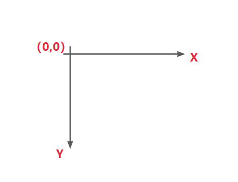
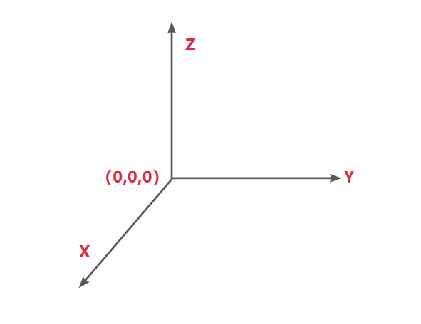
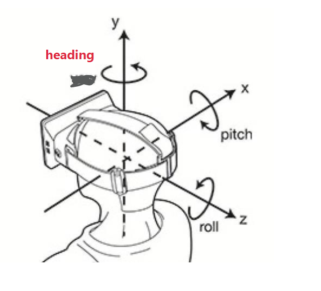

<!--
 * @Author: LittleQ
 * @Date: 2023-03-23 21:15:38
 * @LastEditTime: 2023-03-23 22:37:59
 * @LastEditors: LittleQ
 * @Description: 
 * @FilePath: \NoteBook\cesium\01.md
-->

### 1.cesium中的坐标系统
  - 1. 屏幕坐标系
    二维坐标系，左上角为坐标原点（0,0）,单位为像素，水平方向为X，垂直方向为Y。在cesium中Cartesian2类表示屏幕位置。
      
  - 2. 空间直角坐标系（笛卡尔坐标系）
    三维坐标系，以椭球体的中心为原点, 没有单位。在cesium中以Cartesian3来表示空间位置。
      
  - 3. WGS-84地理坐标系
    使用参考椭球体，使用经度，纬度，高度来表示空间位置。
    经纬度可以使用度数和弧度来表示。
    ```js
    // 1.经纬度转弧度
    let radians = Cesium.Math.toRadians(degrees);
    // 2.弧度转经纬度
    let degrees = Cesium.Math.toDegrees(radians);
    ```
  - 4. WGS-84地理坐标系和笛卡尔坐标系互转
    - (1) WGS84坐标系转Cartesian3
        - a. 通过经纬度进行转换
        ```js
        let cartesian3= Cesium.Cartesian3.fromDegrees(longitude,latitude,height);
        let cartesian3 = Cesium.Cartesian3.fromDegreesArrayHeights(coordinates);
        let cartesian3 = Cesium.Cartesian3.fromDegreesArray(coordinates);
        ```
        - b. 间接转换
        ```js
        // 度数制
        let wgs84 = Cesium.Cartographic.fromDegrees(longitude, latitude, height);
        // 弧度制
        let wgs84 = Cesium.Cartographic.fromRadians(longitude, latitude, height);
        // 使用cartographicToCartesian
        let cartesian3 = Cesium.Ellipsoid.WGS84.cartographicToCartesian(wgs84);
        // 同时转换
        let catesian3 = Cesium.Ellipsoid.WGS84.cartographicArrayToCartesianArray([wgs84])
        ```
    - (2) Cartesian3转WGS84坐标系
        - a. 直接转换
        ```js
        // Cartographic方法
        let cartographic = Cesium.Cartographic.fromCartesian(cartesian3)
        // Ellipsoid 方法
        let cartographic = Cesium.Ellipsoid.WGS84.cartesianToCartographic(cartesian3)
        ```
  - 5. 平面坐标系和笛卡尔空间直角坐标系的转换
    - (1) Cartesian2转Cartesian3
    ```js
    // 包含了地形、倾斜、模型的坐标
    let cartesian3 = viewer.scene.pickPosision(Cartesian2)
    // 包含地形，不包含模型、倾斜摄影表面
    let cartesian3 = viewer.scene.globe.pick(viewer.camera.getPickRay(Cartesian2), viewer.scene);
    // 不包含地形、模型、倾斜摄影表面
    let cartesian3 = viewer.scene.camera.pickEllipsoid(Cartesian2)
    // 相机与屏幕点位连线来求取坐标
    let ray = viewer.camera.getPickRay(cartesian2);
    let cartesian3 = globe.pick(ray,viewer.scene);
    ```
    - (2) Cartesian3转Cartesian2
    ```js
    let cartesian2 = Cesium.SceneTransforms.wgs84ToWindowCoordinates(viewer.scene, cartesian3)
    ```
  - 6. 局部坐标，建立模型或者局部计算时，则需要在计算时使用局部坐标，再转换为椭球笛卡尔坐标后绘图。
  - 
    - (1) Cartesian3转局部坐标系
    ```js
    //建立转换矩阵：
    Cesium.Transforms.eastNorthUpToFixedFrame(origin, ellipsoid, result)

    let modelMatrix = Cesium.Transforms.esatNorthUpToFixedFrame(cartesian3);
    ```
    - (2) 局部坐标系 转 Cartesian3
    ```js
    // point：局部坐标；result：椭球笛卡尔坐标
    let result = Cesium.Matrix4.multiplyByPoint(modelMatrix, point, new Cesium.Cartesian3());
    ```
### 2.使用过cesium哪些功能
### 3.项目比较印象深刻的东西
### 4.几种gis框架对比和优缺点
### 5.cesium的LOD 和相对应的数据格式研究
### 6.使用shader做过哪些东西，如何做的
### 7.UV法向量
### 8.如果一个建筑墙体上的不同面上做不同的贴图
### 9.无人机模型追光实现
### 10. cesium的相机系统
  

Cesium中使用pitch、heading、row三个参数表示相机的姿态，使用position表示相机位置。  
heading：默认方向为正北，正角度为向东旋转，即水平旋转，也叫偏航角。  
pitch：默认角度为-90，即朝向地面，正角度在平面之上，负角度为平面下，即上下旋转，也叫俯仰角。  
roll：默认旋转角度为0，左右旋转，正角度向右，负角度向左，也叫翻滚角。   
