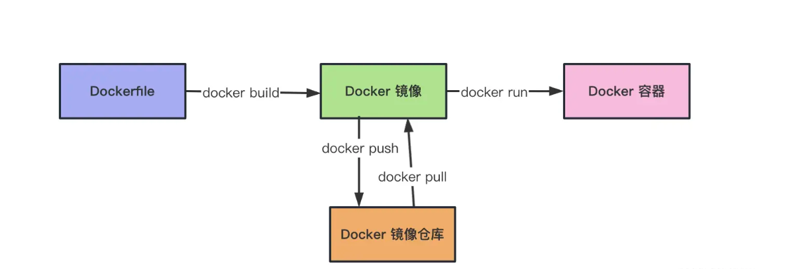

<!--
 * @Author: LittleQ
 * @Date: 2023-02-14 22:02:01
 * @LastEditTime: 2023-03-23 21:15:26
 * @LastEditors: LittleQ
 * @Description:
 * @FilePath: \NoteBook\docker\01.md
-->

# docker 基本概念


  


### docker 安装 postgis

- (1)安装 docker。（省略，自行百度安装）
- (2)拉取 postgis 镜像。 （镜像里面已经包含了 postgresql 数据库）

```js
docker pull postgis/postgis:12-3.3

docker volume create postgis_data

docker volume create pg_data

docker run --name postgis --restart=always -e POSTGRES_USER=postgres -e POSTGRES_PASSWORD=password -e POSTGRES_DBNAME=my_db -p 5432:5432 -v postgis_data:/var/lib/postgis/data -v pg_data:/var/lib/postgresql/data -d postgis/postgis:12-3.3
```
