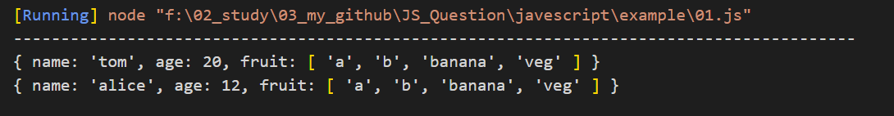
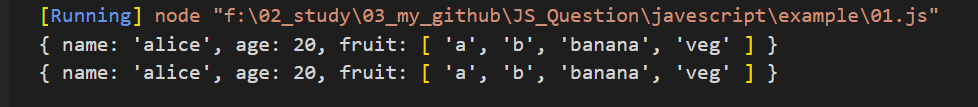

<!--
 * @Author: qlw longwen@spacesystech.com
 * @Date: 2023-02-10 11:36:40
 * @LastEditTime: 2023-02-11 21:55:45
 * @LastEditors: LittleQ
 * @Description: 描述
 * @FilePath: \JS_Question\javescript\01.md
-->

### 1. 深拷贝和浅拷贝的几种实现方式

深拷贝和浅拷贝是针对 Object 和 Array 这样的引用数据类型

#### 1.1 深拷贝

从一个对象拷贝成另外一个对象，改变这个对象对原对象无影响。
实现方法:

```javascript
// (1) 仅仅对Object和Array适用
// 当对象内存在undefined、symbol、function类型的属性时，在序列化过程中此属性会被忽略去除。
// 当属性为NaN 和 Infinity 格式的数值及 null 都会被当做 nul
JSON.parse(JSON.stringify());
```

```javascript
// 当对象没有嵌套对象时
let clone_obj = Object.assign({}, obj);
```

```javascript

```

#### 1.2 浅拷贝

浅拷贝：拷贝对象的每一个属性，如果是基本类型的属性，直接拷贝值，如果是引用类型的属性，拷贝指针地址。新对象的基本类型的属性改变，不影响原对象，引用类型的属性改变，原对象跟着改变。

实现方法:

```javascript
// (1) 展开运算符：...
let clone_obj = { ...obj };

// (2) Object.assign 方法
let clone_obj = Object.assign({}, obj);

// (3) Array.prototype.concat() 方法
let arr2 = arr1.concat([]);

// (4) Array.prototype.slice() 方法
let arr2 = arr1.slice();
```

```javascript
// 浅拷贝
let obj1 = {
  name: "tom",
  age: 20,
  fruit: ["apple", "orange", "banana", "veg"],
};

let obj3 = { ...obj1 };
obj3.name = "alice";
obj3.age = 12;
obj3.fruit[0] = "a";
obj3.fruit[1] = "b";
console.log(obj1);
console.log(obj3);
```



赋值：一个对象赋值给另外一个对象，赋的都是原对象的指针地址。不管这个对象里面属性是基本类型还是引用类型，新对象改变后，原对象都会改变。

```javascript
// 对象赋值
let obj1 = {
  name: "tom",
  age: 20,
  fruit: ["apple", "orange", "banana", "veg"],
};

let obj2 = obj1;
obj2.name = "alice";
obj2.fruit[0] = "a";
obj2.fruit[1] = "b";
console.log(obj1);
console.log(obj2);
```



### 2. 数据类型简介

javascript 作为一种脚本语言，数据类型分为值类型（基本数据类型）和引用数据类型（对象类型）

（1）值类型。直接存储在栈（stack）中的数据

- Number （数字）
- String （字符串）
- Boloean （布尔值）
- Null （空）
- Undefined （未定义）
- BigInt （可以表示任意大的整数）
- Symbol（表示独一无二的值）

（2）引用数据类型。存储的是该对象在栈中引用，真实的数据存放在堆内存里

- Array（数组）
- Function（函数）
- Object（对象）
- Date（日期）
- RegExp（正则）

#### 2.1 栈内存

主要用于存放基本类型和对象变量的指针，算是一种简单的储存； 栈内存自动分配相对固定大小的内存空间，并由系统自动释放

#### 2.2 堆内存

主要用于存放引用类型，存储的对象类型数据对于大小在这方面都是未知的； 堆内存是动态分配内存，内存大小不一，也不会自动释放

#### 2.3 数据类型判断

```javascript
// 通用判断数据类型函数方法
function getDataType(target) {
  const type = Object.prototype.toString.call(target);
  let result = type.replace(/\[object (\w+)\]/, "$1").toLowerCase();
  return result;
}

// string
// number
// boolean
// null
// undefined
// symbol
// bigint

// array
// object
// function
// date
// regexp
```

##### 2.3.1 typeof

- (1) typeof 判断**基本数据类型**：null 返回 object 其余均返回对应数据类型；
- (2) typeof 判断**引用数据类型**：function 返回 function 其余均返回 object；

##### 2.3.2 instanceof

- (1) instanceof 运算符用于检测构造函数的 prototype 属性是否出现在某个实例对象的原型链上； 基本数据类型 不存在 prototype 因此不能使用 instanceof 来判断基本数据类型；
- (2) 所有引用数据都是 Object 的实例，因此通过 instanceof 操作符检测任何引用数据和 Object 构造函数都会返回 true。(理解原型和原型链)

```javascript
const arr1 = [1, 2, 3, 4];
const obj = { age: 20 };

console.log(arr1 instanceof Array); // true
console.log(obj instanceof Object); // true

console.log(arr1 instanceof Object); // true
console.log(obj instanceof Object); // true
```

##### 2.3.3 constructor

基本数据类型的 null 与 undefined 不存在 原型。
如果对象改变了原型，那么使用 constructor 不再准确；

```javascript
// constructor 判断基本数据类型
const string = "apple";
const number = 20;
const bigin = BigInt(658748984551231400);
const boolean = true;
const symbol = Symbol();

console.log(string.constructor === String); // true
console.log(number.constructor === Number); // true
console.log(bigin.constructor === BigInt); // true
console.log(boolean.constructor === Boolean); // true
console.log(symbol.constructor === Symbol); // true
```

```javascript
// constructor 判断引用数据类型
const arr = [1, 3, 4];
const obj = { age: 20 };
const fun = () => {};
const dates = new Date();
const regexp = /[0-9]{1,2}/;

console.log(arr.constructor === Array); // true
console.log(obj.constructor === Object); // true
console.log(fun.constructor === Function); // true
console.log(dates.constructor === Date); // true
console.log(regexp.constructor === RegExp); // true
```
