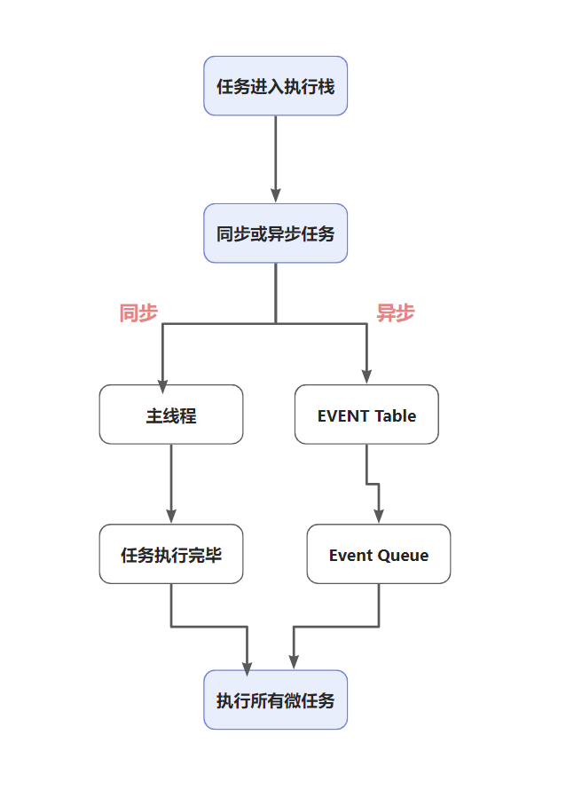

<!--
 * @Author: qlw longwen@spacesystech.com
 * @Date: 2023-02-10 11:36:40
 * @LastEditTime: 2023-03-29 22:14:32
 * @LastEditors: qiulongwen
 * @Description: 描述
 * @FilePath: \NoteBook\javescript\01.md
-->

### 1. 深拷贝和浅拷贝的几种实现方式

深拷贝和浅拷贝是针对 Object 和 Array 这样的引用数据类型

#### 1.1 深拷贝

从一个对象拷贝成另外一个对象，改变这个对象对原对象无影响。
实现方法:

```javascript
// (1) 仅仅对Object和Array适用
// 当对象内存在undefined、symbol、function类型的属性时，在序列化过程中此属性会被忽略去除。
// 当属性为NaN 和 Infinity 格式的数值及 null 都会被当做 nul
JSON.parse(JSON.stringify());
```

```javascript
// 当对象没有嵌套对象时
let clone_obj = Object.assign({}, obj);
```

```javascript

```

#### 1.2 浅拷贝

浅拷贝：拷贝对象的每一个属性，如果是基本类型的属性，直接拷贝值，如果是引用类型的属性，拷贝指针地址。新对象的基本类型的属性改变，不影响原对象，引用类型的属性改变，原对象跟着改变。

实现方法:

```javascript
// (1) 展开运算符：...
let clone_obj = { ...obj };

// (2) Object.assign 方法
let clone_obj = Object.assign({}, obj);

// (3) Array.prototype.concat() 方法
let arr2 = arr1.concat([]);

// (4) Array.prototype.slice() 方法
let arr2 = arr1.slice();
```

```javascript
// 浅拷贝
let obj1 = {
  name: "tom",
  age: 20,
  fruit: ["apple", "orange", "banana", "veg"],
};

let obj3 = { ...obj1 };
obj3.name = "alice";
obj3.age = 12;
obj3.fruit[0] = "a";
obj3.fruit[1] = "b";
console.log(obj1);
console.log(obj3);
```


赋值：一个对象赋值给另外一个对象，赋的都是原对象的指针地址。不管这个对象里面属性是基本类型还是引用类型，新对象改变后，原对象都会改变。

```javascript
// 对象赋值
let obj1 = {
  name: "tom",
  age: 20,
  fruit: ["apple", "orange", "banana", "veg"],
};

let obj2 = obj1;
obj2.name = "alice";
obj2.fruit[0] = "a";
obj2.fruit[1] = "b";
console.log(obj1);
console.log(obj2);
```


### 2. 数据类型简介

javascript 作为一种脚本语言，数据类型分为值类型（基本数据类型）和引用数据类型（对象类型）

（1）值类型。直接存储在栈（stack）中的数据

- Number （数字）
- String （字符串）
- Boloean （布尔值）
- Null （空）
- Undefined （未定义）
- BigInt （可以表示任意大的整数）
- Symbol（表示独一无二的值）

（2）引用数据类型。存储的是该对象在栈中引用，真实的数据存放在堆内存里

- Array（数组）
- Function（函数）
- Object（对象）
- Date（日期）
- RegExp（正则）

#### 2.1 栈内存

主要用于存放基本类型和对象变量的指针，算是一种简单的储存； 栈内存自动分配相对固定大小的内存空间，并由系统自动释放

#### 2.2 堆内存

主要用于存放引用类型，存储的对象类型数据对于大小在这方面都是未知的； 堆内存是动态分配内存，内存大小不一，也不会自动释放

#### 2.3 数据类型判断

```javascript
// 通用判断数据类型函数方法
function getDataType(target) {
  const type = Object.prototype.toString.call(target);
  let result = type.replace(/\[object (\w+)\]/, "$1").toLowerCase();
  return result;
}

// string
// number
// boolean
// null
// undefined
// symbol
// bigint

// array
// object
// function
// date
// regexp
```

##### 2.3.1 typeof

- (1) typeof 判断**基本数据类型**：null 返回 object 其余均返回对应数据类型；
- (2) typeof 判断**引用数据类型**：function 返回 function 其余均返回 object；

##### 2.3.2 instanceof

- (1) instanceof 运算符用于检测构造函数的 prototype 属性是否出现在某个实例对象的原型链上； 基本数据类型 不存在 prototype 因此不能使用 instanceof 来判断基本数据类型；
- (2) 所有引用数据都是 Object 的实例，因此通过 instanceof 操作符检测任何引用数据和 Object 构造函数都会返回 true。(理解原型和原型链)

```javascript
const arr1 = [1, 2, 3, 4];
const obj = { age: 20 };

console.log(arr1 instanceof Array); // true
console.log(obj instanceof Object); // true

console.log(arr1 instanceof Object); // true
console.log(obj instanceof Object); // true
```

##### 2.3.3 constructor

基本数据类型的 null 与 undefined 不存在 原型。
如果对象改变了原型，那么使用 constructor 不再准确；

```javascript
// constructor 判断基本数据类型
const string = "apple";
const number = 20;
const bigin = BigInt(658748984551231400);
const boolean = true;
const symbol = Symbol();

console.log(string.constructor === String); // true
console.log(number.constructor === Number); // true
console.log(bigin.constructor === BigInt); // true
console.log(boolean.constructor === Boolean); // true
console.log(symbol.constructor === Symbol); // true
```

```javascript
// constructor 判断引用数据类型
const arr = [1, 3, 4];
const obj = { age: 20 };
const fun = () => {};
const dates = new Date();
const regexp = /[0-9]{1,2}/;

console.log(arr.constructor === Array); // true
console.log(obj.constructor === Object); // true
console.log(fun.constructor === Function); // true
console.log(dates.constructor === Date); // true
console.log(regexp.constructor === RegExp); // true
```

### 3. 数组去重的方法

- (1) ES6 的 Set 对象去重
  ```js
  // 简单数组去重
  let arr = [1, 1, 2, 3, 4, 5, 6, 2, 3, 4, 4, 5, 6];
  let uniqueArray = Array.from(new Set(arr));
  console.log(uniqueArray);
  // [ 1, 2, 3, 4, 5, 6 ]
  ```
- (2) 双重 for 循环，比较，生成新数组。（省略，方法较笨）
- (3) for 循环(forEach,filter) + Array.indexOf() 或者 Array.includes()
- (4) reduce 和 slice

### 4. 跨域的解决方案

- (1) iframe 嵌套
- (2) postMessage 传值
- (3) nginx 代理
- (4) jsonp callback

### 5. http和https的区别
http和https都是网络通信协议。  
- (1) http协议：是超文本传输协议的缩写，英文是Hyper Text Transfer Protocol，http一般用于bs架构中，是浏览器和web服务器之间**基于TCP/IP通信协议**用来传递数据的一种协议。
- (2) http的特点：
    - a. 支持bs架构模式，是一种**请求/响应**模式的协议
    - b. 支持常用的请求方法，get、post、delete、put等，简单方便
    - c. 传输灵活，基本支持任意类型的数据对象的传输，传输类型由Content-Type来定义
    - d. 无连接，每次连接之处理一个请求，即：每次服务器收到请求后，处理完请求，收到客户端的应答（确认收到请求，三次握手四次挥手）后，就好断开连接。不会一直保持会话连接，由此诞生了Cookie和Session技术，以及websocket(后面再说)
    - e. 无状态，即对于事务处理没有记忆，后续处理同样的请求，依然会重复过程。
    - f. 请求报文，响应报文
- (3) http存在的问题
    - a. 请求信息明文传输，容易被截取
    - b. 数据的完整性未校验，容易被篡改
    - c. 没有验证对方身份，存在被冒充的危险
- (4) https为了解决上述的问题，即https可以理解为http+ssl/tls，通过ssl证书来验证服务器的身份，并为浏览器和服务器之间的通信进行加密。
    - a. SSL 协议位于 TCP/IP 协议与各种应用层协议之间
    - b. 浏览器在使用https传输数据的流程
        1. 首先客户端通过URL访问服务器建立SSL连接。
        2. 服务端收到客户端请求后，会将网站支持的证书信息（证书中包含公钥）传送一份给客户端。  
        3. 客户端的服务器开始协商SSL连接的安全等级，也就是信息加密的等级。  
        4. 客户端的浏览器根据双方同意的安全等级，建立会话密钥，然后利用网站的公钥将会话密钥加密，并传送给网站。  
        5. 服务器利用自己的私钥解密出会话密钥。  
        6. 服务器利用会话密钥加密与客户端之间的通信。
    - c. **https的缺点**
        1. HTTPS协议多次握手，导致页面的加载时间延长近50%；  
        2. HTTPS连接缓存不如HTTP高效，会增加数据开销和功耗；  
        3. 申请SSL证书需要钱，功能越强大的证书费用越高。
        4. SSL涉及到的安全算法会消耗 CPU 资源，对服务器资源消耗较大。 
   
**总结**: https是由http协议加ssl协议组成的，是为了解决http不安全问题，因为https使用了SSL/TLS协议进行了加密处理。http默认端口是80，https默认端口是443。

### 6. tcp和udp
- (1) tcp，是一种面向有连接的传输层协议，能够对自己提供的连接实施控制，适用于要求可靠的传输应用，如文件传输，面向字节流，传输慢。**tcp传输数据稳定可靠**
- (2) udp。是一种面向无连接的传输层协议，不会对自己提供的连接实施控制，适用于实时应用。例如：电话、视频会议、直播。以报文的方式传输，效率高。**tcp传输数据稳定可靠**，可能会存在丢包。
- (3) tcp通信过程：三次握手、传输确认、四次挥手
  **建立连接：三次握手**
  - a. 第一次握手: 客户端发一个SYN包给服务端
  - b. 第二次握手：服务端同意连接，回复SYN+ACK包给客户端
  - c. 第三次握手：客户端收到，发送一个ACK包给服务端，即 连接建立。
    

  **关闭连接：四次挥手**
  - a. 第一次挥手：ESTABLISHED状态的客户端向服务端发送FIN包，标识要关闭连接，客户端进入终止等待1（FIN-WAIT-1）
  - b. 第二次挥手：ESTABLISHED状态的服务端收到FIN包，给客户端发送一个ACK包，标识服务端进入了关闭等待状态（CLOSE-WAIT）,客户端收到后，进入终止等待2状态（FIN-WAIT-2）。**此时服务端还可以发送未发送的数据，而客户端还可以接受数据**
  - c. 第三次挥手：待服务端发送完数据之后，给客户端发送一个FIN包，此时进入最终确认状态。（LAST-ACK）
  - d. 第四次挥手：客户端收到之后服务端的FIN包后，回复ACK包，客户端进入超时等待状态（TIME-WAIT）,经过超时时间后就会关闭连接（CLOSED）。而服务端收到ACK包后，立即关闭连接（CLOSED）
    


### 7. new 的过程，能手动自己简单实现一个

*new 运算符创建一个用户定义的对象数据类型的实例或者具有构造函数内置对象的实例。*

**new** 操作的过程：
- (1) 创建一个新的空的对象
- (2) 然后将空对象的 __proto__ 指向构造函数的原型
      - a. 它将新生成的对象的 __proto__ 属性赋值为构造函数的 prototype 属性，使得通过构造函数创建的所有对象可以共享相同的原型。  
      - b. 这意味着同一个构造函数创建的所有对象都继承自一个相同的对象，因此它们都是同一个类的对象。
- (3) 改变 this 的指向，指向空对象 
- (4) 对构造函数的返回值做判断，然后返回对应的值
      - a. 一般是返回第一步创建的空对象；
      - b. 但是当 构造函数有返回值时 则需要做判断再返回对应的值，是 对象类型则返回该对象，是 原始类型则返回第一步创建的空对象。

```js
function myNew(Con, ...args) {
  // 创建一个新的空对象
  let obj = {};
  // 将这个空对象的__proto__指向构造函数的原型
  // obj.__proto__ = Con.prototype;
  Object.setPrototypeOf(obj, Con.prototype);
  // 将this指向空对象
  let res = Con.apply(obj, args);
  // 对构造函数返回值做判断，然后返回对应的值
  return res instanceof Object ? res : obj;
}


// 测试
// 构造函数Person
function Person(name) {
  this.name = name;
}
let per = myNew(Person, '你好，new');
console.log(per); // {name: "你好，new"}
console.log(per.constructor === Person); // true
console.log(per.__proto__ === Person.prototype); // true


function Person2(name) {
  this.name = name;
  return {
    age: 22
  }
}
let per = myNew(Person2, '你好，new');
// 当构造函数返回对象类型的数据时，会直接返回这个数据， new 操作符无效
console.log(per); // {age: 22}

```

### 8. js的eventloop,事件循环机制

https://blog.csdn.net/chenrongwei92/article/details/120877134

- (1) ***为什么js是单线程？***
js是单线程的，因为js是一门脚本语言，主要是构建页面，操作dom, 与用户交互,决定了他只能是单线程，如果是多线程，就会带来更复杂的同步问题，例如同时操作dom,彼此修改彼此的运行结果，这就违背了js作为一门脚本语言的初衷。
- (2) [Web Worker](https://www.ruanyifeng.com/blog/2018/07/web-worker.html)  
  为了利用多核CPU的计算能力，HTML5提出Web Worker标准，允许JavaScript脚本创建多个线程子线程完全受主线程控制，且不得操作DOM  
  专用线程：var worker = new Worker('worker.js')  
  共享线程：var sharedWorker = new SharedWorker('shared-worker.js')
  ```js
  // 主线程
  var worker = new Worker('worker.js')
  worker.postMessage([10, 24])

  // 接收worker消息
  worker.onmessage = function (e) {
    console.log(e.data) // You post: 10,24
  }
  // 主线程关闭
  // worker.terminate();


  //worker.js。 Worker 线程
  // 写法一
  this.addEventListener('message', function (e) {
    this.postMessage('You post: ' + e.data);
  }, false);

  // 写法二
  addEventListener('message', function (e) {
    postMessage('You said: ' + e.data);
  }, false);

  // Worker 线程关闭
  // self.close();
  ```
- (3) 同步任务：前一个任务执行完成，再执行后一个任务，执行顺序与任务排列顺序一致。
- (4) 异步任务：每一个任务有一个或多个回调函数（callback），前一个任务结束后，不是执行队列上的后一个任务，而是执行回调函数；后一个任务则是不等前一个任务的回调函数的执行而执行，所以程序的执行顺序与任务的排列顺序是不一致的、异步的
- (5) 事件循环：
  - a. *同步任务*进入**主线程**，*异步任务*进入**Event Table**并注册*回调函数*
  - b. 当异步任务的*触发条件满足*，将回调函数从Event Table压入Event Queue [kjuː]中。
  - c. 主线程里面的同步任务执行完毕，系统会去Event Queue中读取异步的回调函数。
  - d. 当主线程空了，就会去Event Queue读取回调函数，这个过程被称为Event Loop。
    

- (6) 异步任务分为**宏任务和微任务**
  - a. 代码开始执行，创建一个全局调用栈，script作为宏任务执行
  - b. 执行过程过同步任务立即执行，异步任务根据异步任务类型分别注册到微任务队列和宏任务队列
同步任务执行完毕，查看微任务队列  
   - 1. 若存在微任务，将微任务队列全部执行(包括执行微任务过程中产生的新微任务)
   - 2. 若无微任务，查看宏任务队列，执行第一个宏任务，宏任务执行完毕，查看微任务队列，重复上述操作，直至宏任务队列为空
    


### 9. 闭包的概念和应用
- (1) 理解作用域
- (2) 闭包的概念：闭包是指有权访问另外一个函数作用域中的变量的函数
- (3) 闭包中的变量存储的位置是堆内存。
- (4) 闭包的作用  
      保护函数的私有变量不受外部的干扰。形成不销毁的栈内存。  
      保存，把一些函数内的值保存下来。闭包可以实现方法和属性的私有化  
  (5) 闭包的使用场景
    - a. 构造函数return一个函数
      ```js
        var n = 10
        function fn(){
            var n =20
            function f() {
              n++;
              console.log(n)
            }
            return f
        }
        var x = fn()
        x() // 21
      ```  
    - b. 函数作为参数
      ```js
      var a = 'test'
      function foo(){
          var a = 'foo'
          function fo(){
              console.log(a)
          }
          return fo
      }
      function f(p){
          var a = 'f'
          p()
      }
      f(foo())  /* 输出foo
      ```    
    - c. IIFE（自执行函数）
      ```js
      var n = 'test';
      (function pp(){
          console.log(n)
      })() //输出test
      ``` 
    - d. 循环赋值
      ```js
      for(let i = 0; i<10; i++){
        (function(j){
            setTimeout(function(){
              console.log(j)
          }, 1000) 
        })(i)
      }
      // 使用async和await和闭包，解决异步调用问题。批量请求处理中常用（先后顺序）。
      for (let n = 0; n <length; n++) {
        await (async function (k) {
          // todo something
        })(n);
      }
      ```
    - e. 回调函数 callback是使用了闭包。
    - f. 节流和防抖中常用
    - g. 函数柯里化
### 10. Promise的应用，手动实现
- (1) Promise的三种状态 初始状态pending，resolve回调后的fulfilled（已成功）。reject回调后的rejected（已失败）
- (2) 规定必须给Promise对象传入一个执行函数，否则将会报错 new Promise(()=>{})
- (3) 只有resolve和reject或者throw才能改变promise的初始状态pending

### 11. async 和 await的应用

### 12. js的同步和异步编程

### 13. Es6的Map和Set

### 14. js数组循环map和forEach

### 15. 缓存方案之：localStorage、sessionStorage、cookies、indexDB  有什么区别，分别怎么应用?

### 16. 性能优化

### 17. 白屏解决方案
1. 骨架屏
2. loadIng
  
### 18. 防抖和节流的概念和应用，以及实现
  - (1) 什么是防抖  
    概念：将若干个函数调用合成为一次，并在给定时间过去之后仅被调用一次。
    非立即执行版本（概念）：在第一次触发事件时，不立即执行函数，若计时器的时间间隔之内没有再次触发事件，delay时间到了就执行函数；在计时器时间间隔内又触发新的事件，会清除计时器，重新计时，delay时间到了会再执行函数。  
    立即执行版本（概念）：触发事件后函数会立即执行，然后 n 秒内不触发事件才能继续执行函数的效果

    应用场景：搜索框，一定时间内再触发就要重新计时，以最新的条件去查询结果。
    ```js
    /**
    * @desc 函数防抖
    * @param func 函数
    * @param wait 延迟执行毫秒数
    * @param immediate true 表立即执行，false 表非立即执行
    */
    function debounce(func,wait,immediate) {
        var timeout;
        return function () {
            var context = this;
            var args = arguments;

            if (timeout) clearTimeout(timeout);
            if (immediate) {
                var callNow = !timeout;
                timeout = setTimeout(function(){
                    timeout = null;
                }, wait)
                if (callNow) func.apply(context, args)
            }
            else {
                timeout = setTimeout(function(){
                    func.apply(context, args)
                }, wait);
            }
        }
    }
    ```
  - (2) 什么是节流  
    概念：节流函数不管事件触发有多频繁，都会保证在规定时间内一定会执行一次真正的处理函数。
    时间戳版本：第一次触发事件，会立即执行，后面每delay执行一次，一直到最后一次事件触发执行。
    定时器版本：第一次触发事件，delay后执行函数，生成定时器，定时器期间再触发事件，还是会delay后执行函数。


  


### 19. js数组Array的常用的方法和应用

### 20. URL和URI的区别
HTTP使用统一资源标识符（Uniform Resource Identifiers, URI）来传输数据和建立连接。

URI：Uniform Resource Identifier 统一资源标识符
URL：Uniform Resource Location 统一资源定位符

URI 是用来标示 一个具体的资源的，我们可以通过 URI 知道一个资源是什么。

URL 则是用来定位具体的资源的，标示了一个具体的资源位置。互联网上的每个文件都有一个唯一的URL。

### 21. get和post的区别

都包get用来查询，参数放在url后面，不会对服务器商的内容产生作用，post用来提交，参数一般包在报文内部，get提交的数据长度是有限制的，因为URL地址的长度是有长度限制的，具体的长度限制一般根据不同浏览器而定，post没有长度限制

### 22. 函数柯里化

### 23. 数组乱序的实现
注意：
```js
// 暴力排序，借助一个随机数
function shuffle(arr) {
    let new_arr = arr.map(i => ({v: i, r: Math.random()}));
    new_arr.sort((a, b) => a.r - b.r);
    arr.splice(0, arr.length, ...new_arr.map(i => i.v));
}
// 洗牌算法
function shuffle(arr) {
    let i = arr.length;
    while (--i) {
        let j = Math.floor(Math.random() * i);
        [arr[j], arr[i]] = [arr[i], arr[j]];
    }
}
```
