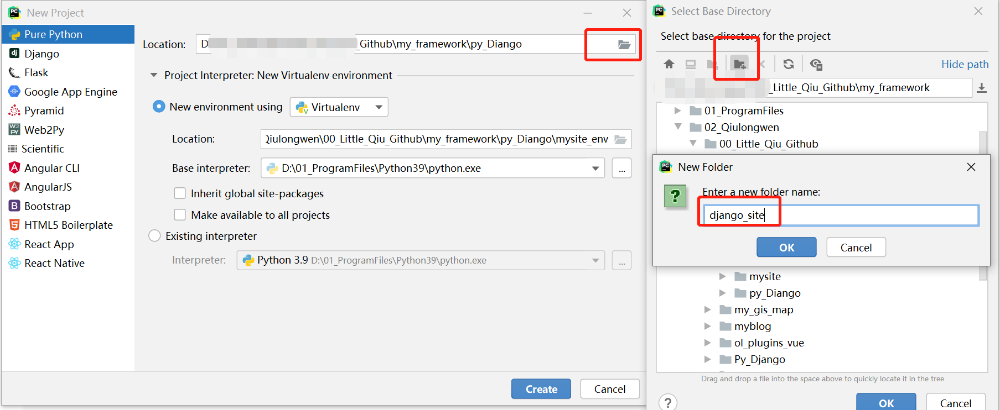
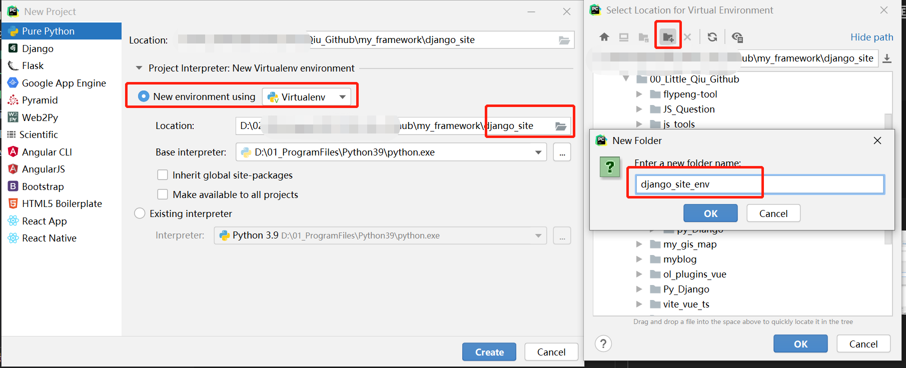
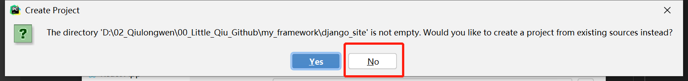
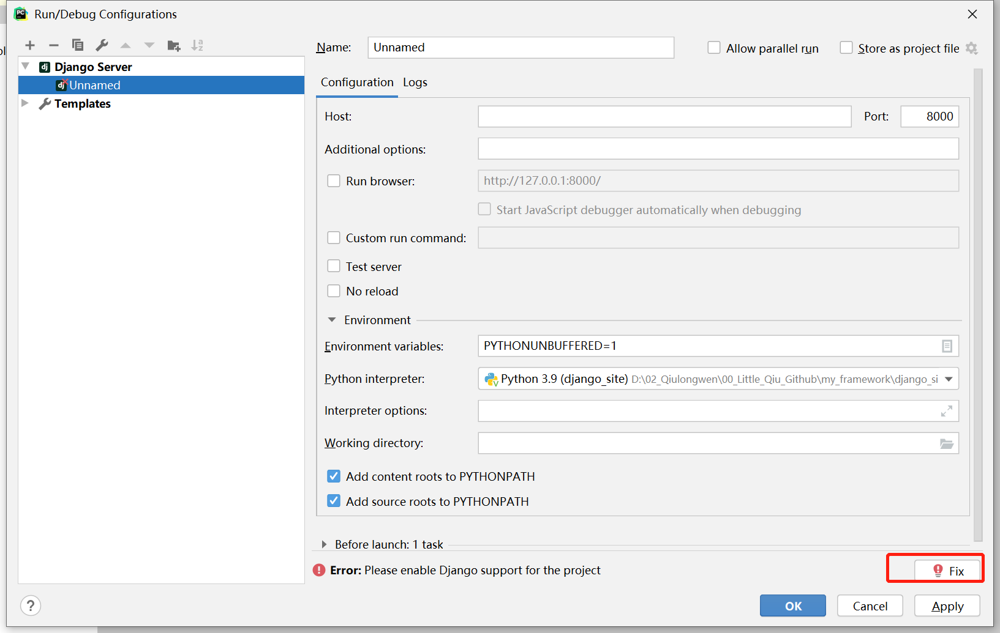
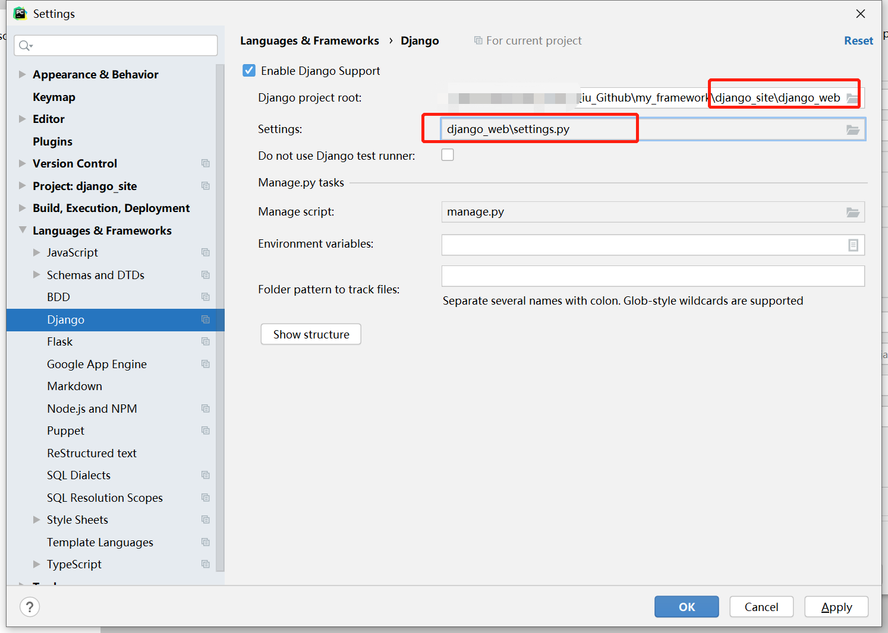

<!--
 * @Author: LittleQ
 * @Date: 2023-02-13 22:47:03
 * @LastEditTime: 2023-02-13 23:24:43
 * @LastEditors: LittleQ
 * @Description:
 * @FilePath: \JS_Question\python\01_Django.md
-->

### 1. python 环境安装，我这里使用的是 3.9 版本的 py

### 2. 开发工具安装，我这里使用的是 pycharm

### 3.基于 pycharm 搭建 django 开发框架

#### 3.1 创建 python 虚拟环境

- (1) 升级 pip 版本
  ```python
  python -m pip install --upgrade pip
  // 查看安装包列表
  pip list
  ```
- (2) 创建项目
  

- (3) 创建虚拟环境
  
  

#### 3.2 pip 安装 Django

- （1）使用清华源安装 django

```python
pip install django -i https://pypi.tuna.tsinghua.edu.cn/simple
```

- (2) 用 Django 自带的脚手架工具 django-admin 创建项目
  ```python
  django-admin startproject django_news
  cd django_news
  ```
- (3) 给项目配置 django server
  

  
