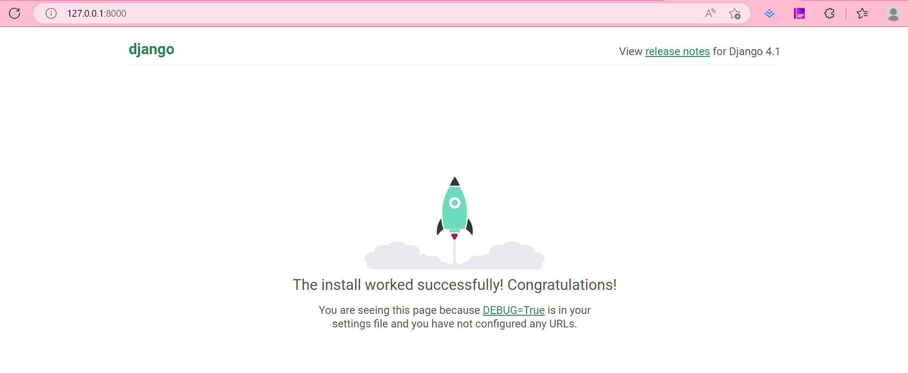
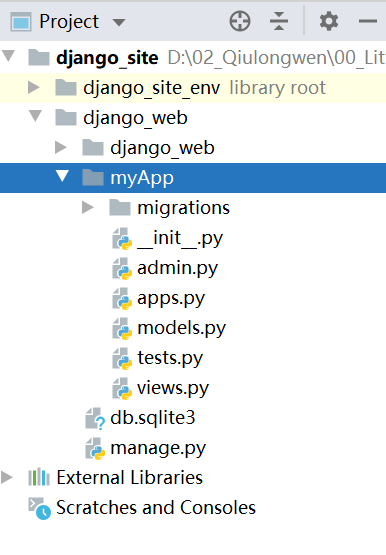

<!--
 * @Author: LittleQ
 * @Date: 2023-02-13 22:47:03
 * @LastEditTime: 2023-02-13 23:35:52
 * @LastEditors: LittleQ
 * @Description:
 * @FilePath: \JS_Question\python\01_Django.md
-->

### 1. python 环境安装，我这里使用的是 3.9 版本的 py

### 2. 开发工具安装，我这里使用的是 pycharm

### 3. 基于 pycharm 搭建 django 开发框架

#### 3.1 创建 python 虚拟环境

- (1) 升级 pip 版本
  ```python
  python -m pip install --upgrade pip
  // 查看安装包列表
  pip list
  ```
- (2) 创建项目
  

- (3) 创建虚拟环境
  
  

#### 3.2 pip 安装 Django

- （1）使用清华源安装 django

```python
pip install django -i https://pypi.tuna.tsinghua.edu.cn/simple
```

- (2) 用 Django 自带的脚手架工具 django-admin 创建项目
  ```python
  django-admin startproject django_web
  cd django_web
  ```
- (3) 给项目配置 django server
  

  

#### 3.3 安装成功运行

```arduino
django_site
├── django_web              // 项目全局文件目录
│   ├── __init__.py
│   ├── settings.py          // 全局配置
│   ├── urls.py              // 全局路由
│   └── wsgi.py              // WSGI服务接口
└── manage.py                // 项目管理脚本
```



### 4. 创建一个自定义的 app

```python
python manage.py startapp myApp
```



```arduino
myApp                     // myApp 应用目录
├── __init__.py          // 初始化模块
├── admin.py             // 后台管理配置
├── apps.py              // 应用配置
├── migrations           // 数据库迁移文件目录
│   └── __init__.py      // 数据库迁移初始化模块
├── models.py            // 数据模型
├── tests.py             // 单元测试
└── views.py             // 视图
```
