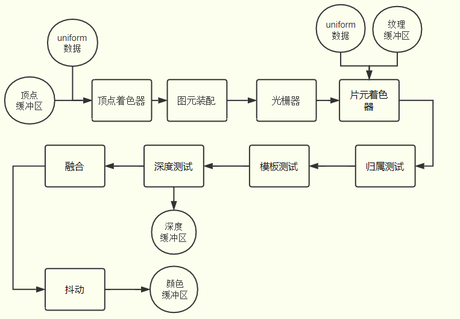
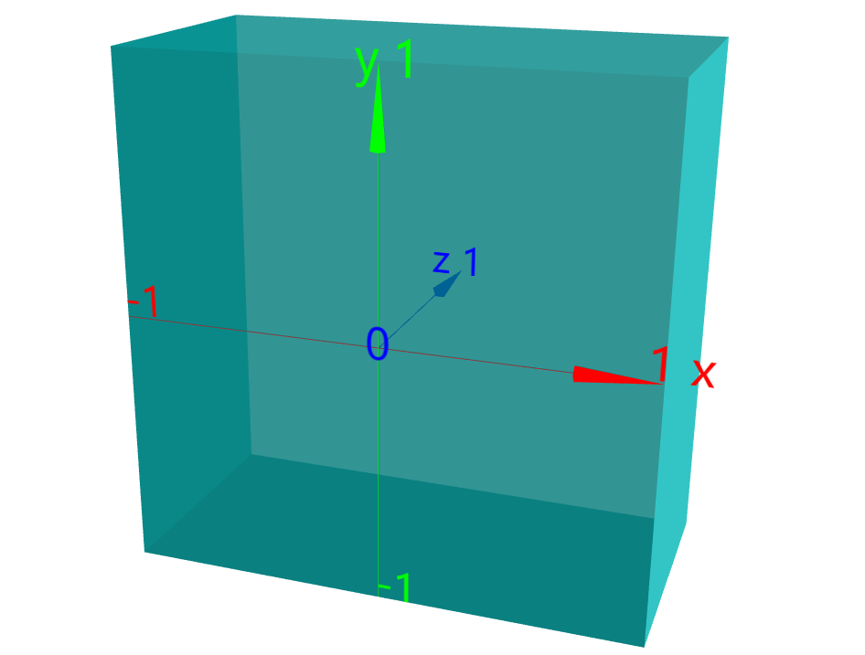

<!--
 * @Author: qlw longwen@spacesystech.com
 * @Date: 2023-06-20 14:42:05
 * @LastEditTime: 2023-06-20 15:40:15
 * @LastEditors: qlw longwen@spacesystech.com
 * @Description: webgl基础
 * @FilePath: \LittleNoteBook\threeJs\01.md
-->
### webgl基础
  

1. gpu渲染,GPU相比CPU最大的特点是并行计算.
2. 顶点着色器，片元着色器。
3. https://developer.mozilla.org/zh-CN/docs/Web/API/WebGLRenderingContext
4. glsl es 着色器语言，attribute 关键字。
5. webgl坐标系  
  
