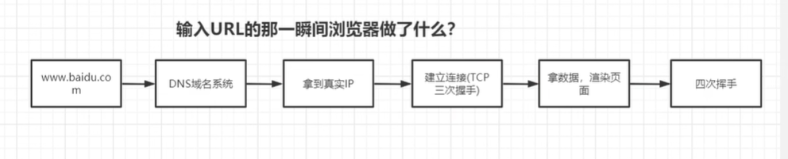

## 1. 输入URL的那一瞬间浏览器做了什么？

- 第一次访问
域名 => DNS域名解析 => 拿到真实IP => 建立连接（TCP的三次握手） => 拿到数据，页面渲染 => 四次挥手

  

- 第二次访问
  将域名解析的Ip缓存在本地 => 读取浏览器缓存


## 2. TCP三次握手，四次挥手

## 3. 页面是怎么渲染的？

html+css => dom树+ css结构体 => render tree => 计算布局信息 => UI引擎渲染 => 页面

  

## 4. 日常开发中，从哪些点做性能优化？（内存占用、页面加载性能、动画与操作性能、电量消耗）
- 前端
  a. 加载
    1. 减少Http请求。（精灵图、文件合并）
    2. 减少文件大小（资源压缩，图片压缩，代码压缩）
    3. CDN(第三方库)
    4. SSR服务端渲染，预渲染
    5. 懒加载
    6. 分包
  b. 性能
    1. 减少dom操作，避免回流，文档碎片  
  c. 代码逻辑（执行效率），谈不上是性能优化
    1. 循环
- GIS

## this 作用域

## 闭包，为什么有闭包？
    1. 避免变量污染
    2. 私有化
    3. 保存变量
    4. 闭包应用场景：防抖节流函数，库的封装
AO => Active Object
  

## new 关键字，new的一瞬间做了什么？
1. 创建一个空对象
```js
let obj = Object.create();
```
```js
// 两者区别
let obj1 = Object.create(null);
let obj2 = {};
```
2. 设置原型链
```js
obj._proto_ = Person.prototype

```
3. 改变this指向
```js
let result = Person.call(obj)
```
4. 判断返回值类型
```js
if(typeof(result) == 'object'){

} else {

}
```

## 原生js的事件委托
1. 什么是事件委托？
   事件委托就是利用事件冒泡，只指定一个事件处理程序，就可以管理某一类型的所有事件
   例如: 点击 Ul => Li 标签
  

